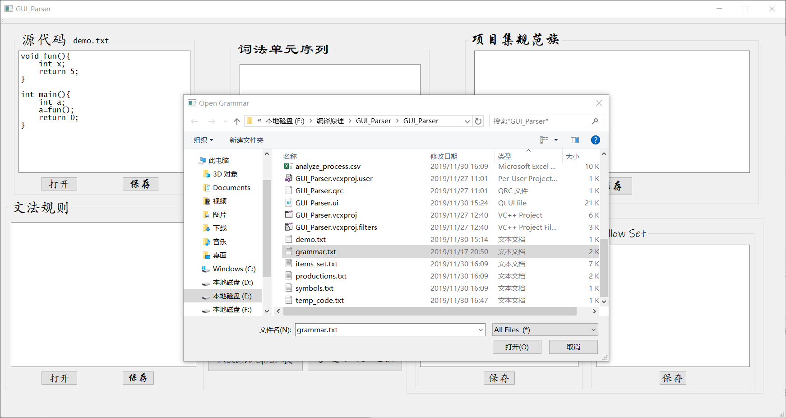

# Syntactic-Analyzer

**同济大学计算机专业《编译原理》课程实验——语法分析器**

## 一、实验任务

### 1.1 实验目的

- 1. 掌握语法分析器的生成原理，通过调用词法分析器对源代码进行语法分析。
- 2. 掌握使用高级程序语言实现简单语言的$SLR(1)$语法分析器的方法。
- 3. 掌握将生成结果写入文件的技术。

### 1.2 实验要求

- 1. 使用高级程序语言作为实现语言，根据$SLR(1)$分析方法，编写一个类C语言的语法分析程序。根据已知文法，由程序自动生成该文法的$ACTION$表和$GOTO$表，编码实现语法分析器的组成部分。
- 2. 语法分析程序调用词法分析程序，对输入的一个文法和一个单词串，判断其正确性，并输出移进—归约的过程。

## 二、操作说明

&emsp;&emsp;程序能够根据输入的语法规则，产生相应的项目集规范族、First/Follow集、action goto 表等语法分析资源文件，并调用词法分析器，根据导入的源程序分析源文件的词法结构，将字符串中的内容单独独立为$<Type,\ Index,\ Value>$的三元组格式，然后按照文法产生式，根据词法分析器识别的单词属性，以$SLR(1)$的规则进行移进-归约分析，并将其过程写入到文件中。

&emsp;&emsp;程序初始时为空白文本框界面，通过“**源代码**”和“**文法规则**”两个框的“**打开**”按钮选择需要进行语法分析的源代码和文法规则文件并打开，或者也可以采用直接在相应的文本框中输入。

↑打开源代码

&ensp;

↑打开文法规则

&ensp;

&emsp;&emsp;此时左侧文本框中显示源程序的代码和文法规则，并且给出文件的名称。

&emsp;&emsp;左侧的源代码和文法规则的文本框可以根据需要进行编辑修改，并且**不会**改动源文件的内容；只有点击“**保存**”后才会将文本框中的内容写回原路径。
&emsp;&emsp;点击窗体中间的“**语法分析**”按键，便对左侧文本框中的源代码按照选定的文法规则进行语法分析，并产生相应的资源文件和结果文件。

&emsp;&emsp;如上图所示，在点击“**语法分析**”后，$First/Follow集$框中显示对应的由文法规则导出的集合，右上角的“项目集规范族”中显示文法的项目集规范族；中间按钮上部为分析过程中产生的词法单元序列，此时这些内容均为暂存，如果想要保存这些结果，需要点击对应的“**保存**”按键。

&emsp;&emsp;在“**语法分析**”按钮的下方有5个按钮，点击分别可以查看语法分析过程中不便于在窗口显示的资源和结果文件。

&emsp;点击“**文法产生式**”可以打开$"./productions.txt"$，查看文法规则在右部单一化后的产生式：

&emsp;点击“**文法项目**”可以打开$"./items.txt"$，查看文法产生式在添加'·'后的$LR$文法项目：

&emsp;点击“**文法符号**”可以打开$"./symbols.txt"$，查看文法规则中所含有的全部标识符（按照先非终结符后非终结符的顺序）：

&emsp;点击“**Action Goto 表**”可以打开$"./action\_goto\_table.csv"$，查看根据输入/导入的文法规则所导出的$SLR(1)$分析表：

&emsp;点击“**移进-归约 过程**”可以打开$"./analyze\_process.csv"$，查看源代码按照给定的文法规则进行语法分析的移进-归约过程，其中包含序号、状态栈、符号栈以及相应的解释说明：

